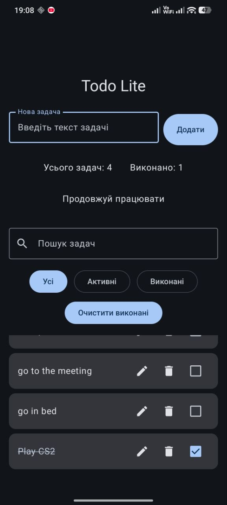
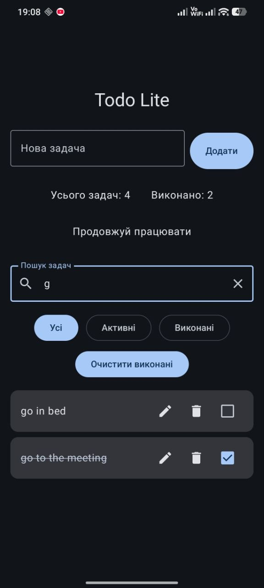
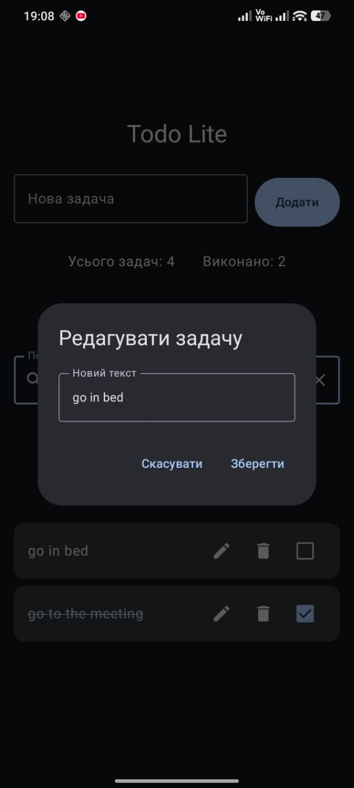
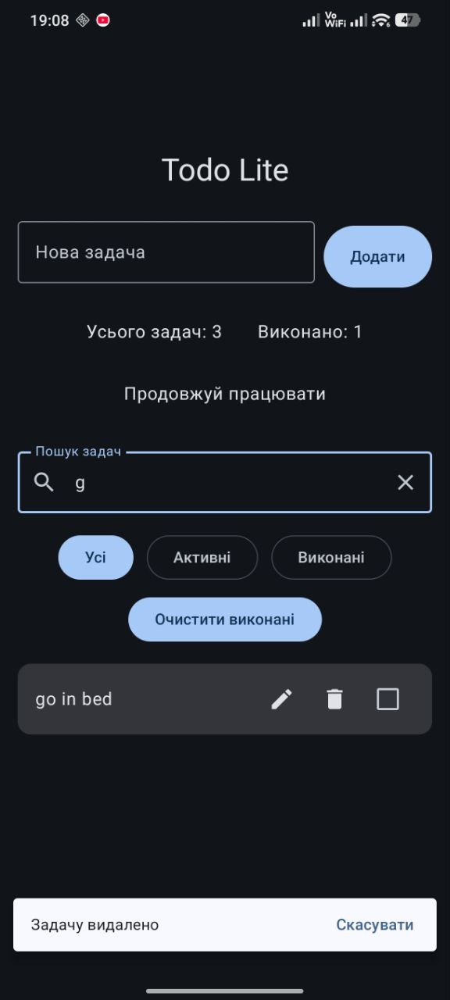

# TodoLite

TodoLite is a simple Android todo application built with Kotlin, Jetpack Compose, Room, Flow and MVVM.

## Features

- Add new tasks
- Edit existing tasks
- Delete tasks
- Undo task deletion
- Mark tasks as completed
- Filter tasks by status
- Search tasks by title
- Clear completed tasks
- Undo clearing completed tasks
- Save tasks locally with Room

## Tech Stack

- Kotlin
- Jetpack Compose
- Material 3
- Room
- Flow
- ViewModel
- MVVM architecture

## Architecture

The project uses a simple layered structure:

- `presentation` — screens, components, ViewModel
- `domain` — models and repository interface
- `data` — Room database, DAO, entities, repository implementation

## Screenshots

### Main screen


### Search


### Edit task


### Undo delete


## How to Run

1. Clone the repository:

```bash
git clone https://github.com/maksympash-code/TodoLite.git